# 🚀 Изучение способов оптимизаций на примере рендеринга Множества Мандельброта

# 📚 Содержание
- [🚀 Изучение способов оптимизаций на примере рендеринга Множества Мандельброта](#🚀-изучение-способов-оптимизаций-на-примере-рендеринга-множества-мандельброта)
- [📋 О проекте](#📋-о-проекте)
- [🌈 Примеры из проекта](#🌈-примеры-из-проекта)
- [⚙️ Requirements](#️⚙️-requirements)
- [🔧 Инструкции по сборке](#🔧-инструкции-по-сборке)
- [📊 План работы](#📊-план-работы)
- [💻 Технические характеристики устройства](#💻-технические-характеристики-устройства)
- [🛠️ Ход работы над проектом](#️🛠️-ход-работы-над-проектом)
- [⚡ Векторные инструкции](#⚡-векторные-инструкции)
- [🔬 Intrinsic функции](#🔬-intrinsic-функции)
- [📈 Обзор методов отрисовки](#📈-обзор-методов-отрисовки)
- [⏱️ Вычисление времени работы](#️⏱️-вычисление-времени-работы)
- [🎯 Подробнее про оптимизации](#🎯-подробнее-про-оптимизации)
- [🔍 Самое интересное](#🔍-самое-интересное)
- [💡 Заключение](#💡-заключение)

---

## 📋 О проекте

Этот проект представляет собой прорисовку множества Мандельброта, с использованием графической библиотеки SFML. В целях обучения рассматриваются три версии рендеринга множества:
1) Наивное просчитывание точек
2) Развёртка циклов (Loop unrolling)
3) Использование SIMD (Single Instruction, Multiple Data) инструкций
Множество Мандельброта — это известный фрактал, славящийся своими сложными и визуально впечатляющими узорами, которые генерируются путем итерации простой математической формулы над комплексными числами, проблема заключается в том, что она рекурсивная, поэтому для каждого пикселя на экране необходимо произвести подсчёты. Также существует формула для вычисления множества в виде итеративной последовательности значений координат комплексной плоскости (x, y), её и будем использовать.

### Формула имеет вид:
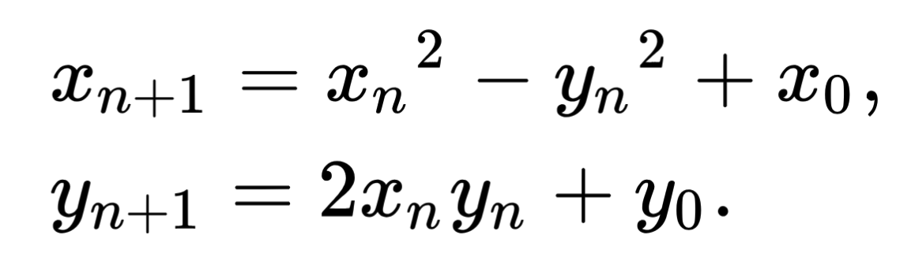

### 🌈 Примеры из проекта
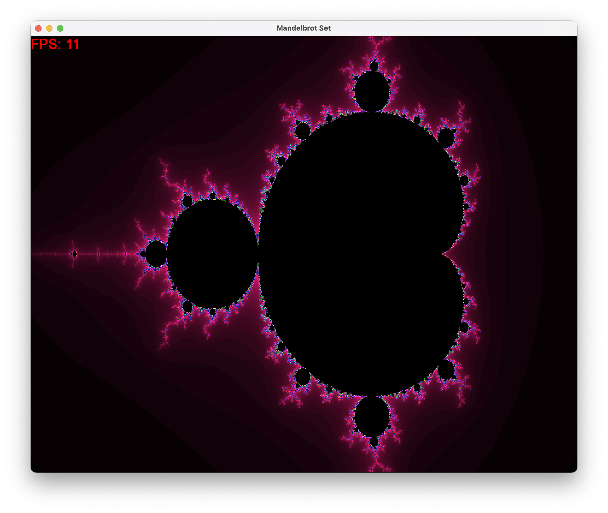
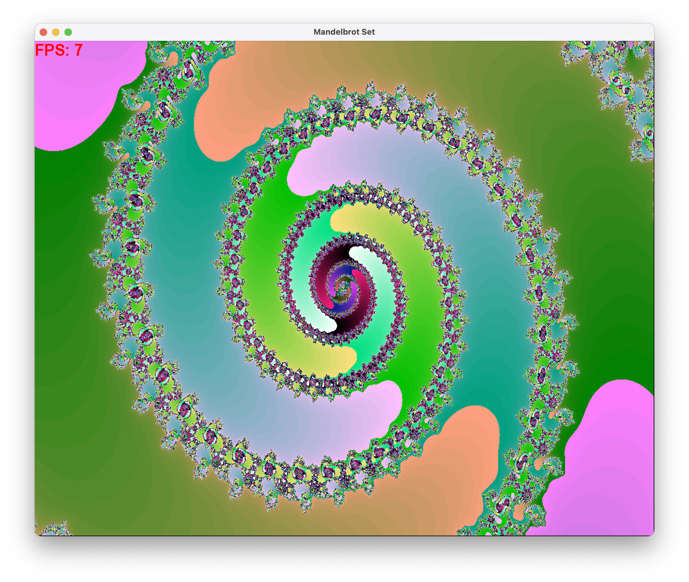
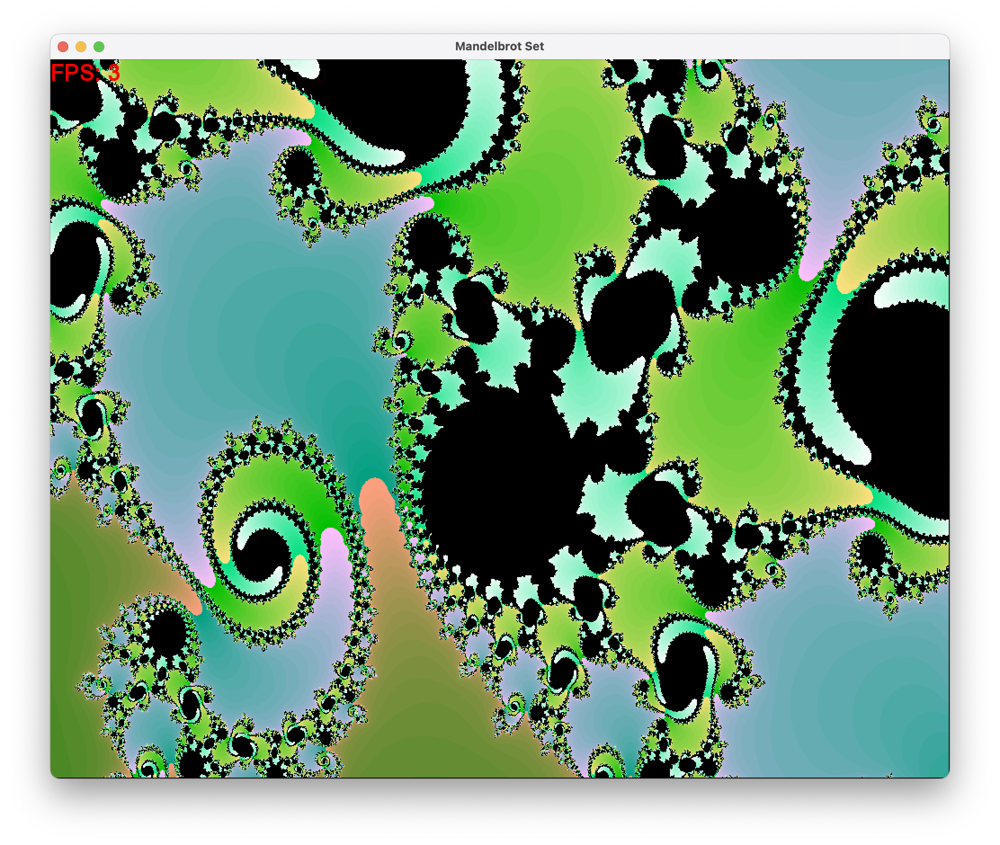

## ⚙️ Requirements

- Проект использует Arm Neon Intrinsics, убедитесь, что ваш процессор принадлежит семейству AArch64 и поддерживает векторные инструкции.
- Python
- Make, CMake
- SFML3

## 🔧 Инструкции по сборке
1) Склонируйте репозиторий:
```bash
git clone https://github.com/livlavr/MandelbrotSet
```
2) Перейдите в папку проекта и создайте папку build
```bash
mkdir build
```
3) Сгенерируйте makefile с помощью CMake
```bash
cmake -S . -B build -DCMAKE_BUILD_TYPE=Release -DUNROLL_LEVEL=16
```

> [!CAUTION]
> Если будет выбран другой тип сборки (не Release), то оптимизации развёртки не будут работать, так как компилятор не сможет применить оптимизации без флага -O3

`-DUNROLL_LEVEL=16` - флаг для выбора степени развертки циклов, по умолчанию `16`, каждый раз при изменении степени развертки необходимо заново собирать проект через cmake. (это было сделано для облегчения выполнения тестов)

4) Соберите проект
```bash
cd build && make
```
5) **Можно запускать!**
```bash
./MandelbrotSet
```
6) Для запуска тестов используйте
```bash
./StartTests.sh
```
7) Чтобы очистить репозиторий от файлов сборки
```bash
./Clean.sh
```

### Флаги
--graphics: no argument, включает графику (флаг по умолчанию)
--no-graphics: no argument, выключает графику
--test: required argument, краткая версия: -t, количество тестов
--native: no argument, версия без оптимизаций (по умолчанию)
--unroll: no argument, версия с разверткой циклов
--simd: no argument, версия, использующая векторные инструкции

## 📊 План работы

Множество Мандельброта определяется как набор комплексных чисел, для которых последовательность, заданная итеративной формулой, не расходится. На практике для каждого пикселя изображения:
- Координаты пикселя преобразуются в реальные координаты комплексной плоскости.
- Формула итерируется до достижения максимального количества итераций или выхода за пределы установленного диапазона от центра отсчета (Мандельброт доказал, что если длина радиус вектора для точки на какой-либо итерации превышает 2, то точка гарантированно не попадет в множество).

Такая последовательность считается расходящейся, и пиксель окрашивается в зависимости от количества итераций, потребовавшихся для превышения этого порога. Пиксели, которые не расходятся в пределах максимального числа итераций, считаются частью множества и окрашиваются в черный цвет.

Векторные инструкции позволяют выполнять одну и ту же операцию над некоторым набором данных одновременно. В этом проекте используются инструкции SIMD (Arm Neon Intrinsics) для вычисления итераций сразу для двух точек, что сокращает общее время вычислений по сравнению с обработкой каждого пикселя по отдельности.

## 💻 Технические характеристики устройства, на котором производились измерения

## Процессор и архитектура

- **Чип**: Apple M2 Pro
- **Архитектура**: AArch64
- **Количество ядер CPU**: 10
  - 6 ядер высокой производительности (high-performance cores)
  - 4 ядра высокой эффективности (high-efficiency cores)
- **Частота процессора**:
  - Высокопроизводительные ядра: до 3,5 ГГц
  - Эффективные ядра: до 2,4 ГГц
- **Кэш-память**:
  - Высокопроизводительные ядра (GPU):
    - L1: 192 КБ (инструкции) + 128 КБ (данные) на ядро
    - L2: 32 МБ (общий для высокопроизводительных ядер)
  - Эффективные ядра (CPU):
    - L1: 128 КБ (инструкции) + 64 КБ (данные) на ядро
    - L2: 4 МБ (общий для эффективных ядер)
- **Объем памяти**: 16 ГБ RAM
- **Пропускная способность памяти**: 200 ГБ/с

**Источники**: *Технические характеристики основаны на официальных данных Apple и сторонних технических обзорах. (https://mactracker.ca/index.html)*

## 🛠️ Ход работы над проектом

1. **Настройка контекста**: Определение размеров изображения (ширина и высота), максимального числа итераций и области комплексной плоскости для рендеринга.

2. **Рендеринг пикселей**:
   - Для каждого пикселя преобразовать его координаты на экране в координаты на комплексной плоскости. В примере ниже `window_x` и `window_y` - координаты пикселя, `real_x`, `real_y` - получившиеся координаты точки на комплексной плоскости
        ```c
            double offset_x = ((double)window_x - WINDOW_WIDTH  / 2.0) / WINDOW_WIDTH;
            double offset_y = ((double)window_y - WINDOW_HEIGHT / 2.0) / WINDOW_HEIGHT;

            double real_x = center_x + offset_x * REAL_WIDTH * scale;
            double real_y = center_y + offset_y * REAL_HEIGHT * scale;
        ```

   - Итерировать формулу до тех пор, пока `|radius_v|` не станет больше чем `MAX_RADIUS` (3.0) или не будет достигнуто `MAX_ITERATIONS_COUNT`.

   - Назначить цвет пикселю на основе количества выполненных итераций.
        ```c
        if(counter >= MAX_ITERATIONS_COUNT) {
            return sf::Color::Black;
        } else {
            uint8_t r = (8 * counter) % 255;
            uint8_t g = (1 * counter) % 255;
            uint8_t b = (4 * counter) % 255;

            sf::Color color{r, g, b, 255};

            return color;
        }
        ```

3. **Отрисовка изображения**: Сгенерировать изображение, используя графическую библиотеку SFML3.

## ⚡ Векторные инструкции

Многие современные процессоры имеют специальное оборудование, позволяющее одной инструкции параллельно выполнять несколько операций. Этот режим известен как одиночный поток команд, множественный поток данных
(Single-Instruction Multiple-Data, SIMD). Эти инструкции предоставляются в основном для ускорения приложений, обрабатывающих изображения, звук и видео. Некоторые компиляторы пытаются автоматически использовать параллелизм этого вида в программах на C, но все же более надежным методом является разработка программ с использованием специальных типов векторных данных, поддерживаемых компиляторами, такими как GCC.

**Источники**: *Рэндал Э.Брайант Дэвид Р. О'Халларон "Компьютерные системы. Архитектура и программирование" Третье издание*

## 🔬 Intrinsic функции

Intrinsic функции — это функции, предоставляемые компилятором, которые напрямую соответствуют определенным ассемблерным инструкциям, включая операции SIMD. Эти функции позволяют разработчикам писать векторизованный код на C или C++ без необходимости напрямую использовать ассемблер. В этом проекте Arm Neon Intrinsic функции используются для реализации векторизованных вычислений множества Мандельброта.

## 📈 Обзор методов отрисовки

Проект включает несколько методов рендеринга множества Мандельброта:
- **Наивная версия**: Простая реализация, которая демонстрирует поочередное вычисление для каждого пикселя.

- **Оптимизированная версия**: Данный метод приближен к наивной реализации, но использует развертку циклов с помощью массивов состоящих из `UNROLL_LEVEL` элементов.

> [!NOTE]
> Все оптимизированные версии должны компилироваться с флагом оптимизаций -O3, в противном случае компилятор не подставит векторные инструкции и программа будет работать даже медленнее наивной версии

- **Векторизованная версия**: В этом методе используются Arm Neon Intrinsic функции, позволяющие напрямую контролировать применение SIMD инструкций.

Эти методы позволяют напрямую сравнить производительность скалярного и векторизованного подходов, демонстрируя преимущества параллельных вычислений, а также возможности современных компиляторов.

## ⏱️ Вычисление времени работы

Будем производить измерения в тактах, так как данный метод имеет наибольшую точность среди прочих и позволяет избежать погрешности, вносимой изменением тактовой частоты процессора.

Так как работа выполнялась на процессоре архитектуры AArch64 - для подсчета количества тиков используется функция, возвращающая значение виртуального регистра CNTVCT_EL0, значение которого эквивалентно значению физического счётчика минус виртуальное смещение, отображаемое в CNTVOFF_EL2.

```c
static inline uint64_t rdtsc(void) {
    uint64_t time_value = 0;
    asm volatile("mrs %0, cntvct_el0" : "=r" (time_value));

    return time_value;
}
```

## 🎯 Подробнее про оптимизации

> [!NOTE]
> В проекте были рассмотрены две версии рендеринга, оптимизированного при помощи развертки циклов, далее мы рассмотрим как, на первый взгляд, незначительные изменения алгоритма могут быть причиной ощутимых изменений производительности программы.

## Первая версия алгоритма:
```c
    for(size_t i = 0; i < UNROLL_LEVEL; i++) {
        radius_vector_x_coords[i] = x_coords[i];
        radius_vector_y_coords[i] = y_coords[i];
    }

    while(continue_rendering) {
        for(size_t i = 0; i < UNROLL_LEVEL; i++) {
            xn[i] = radius_vector_x_coords[i];
        }
        for(size_t i = 0; i < UNROLL_LEVEL; i++) {
            yn[i] = radius_vector_y_coords[i];
        }

        for(size_t i = 0; i < UNROLL_LEVEL; i++) {
            radius_vector_x_coords[i] = xn[i] * xn[i];
        }
        for(size_t i = 0; i < UNROLL_LEVEL; i++) {
            radius_vector_x_coords[i] -= yn[i] * yn[i];
        }
        for(size_t i = 0; i < UNROLL_LEVEL; i++) {
            radius_vector_x_coords[i] += x_coords[i];
        }

        for(size_t i = 0; i < UNROLL_LEVEL; i++) {
            radius_vector_y_coords[i] = 2 * xn[i] * yn[i];
        }
        for(size_t i = 0; i < UNROLL_LEVEL; i++) {
            radius_vector_y_coords[i] += y_coords[i];
        }

        for(size_t i = 0; i < UNROLL_LEVEL; i++) {
            radius_vector_length[i] = radius_vector_x_coords[i] * radius_vector_x_coords[i];
        }
        for(size_t i = 0; i < UNROLL_LEVEL; i++) {
            radius_vector_length[i] += radius_vector_y_coords[i] * radius_vector_y_coords[i];
        }
        for(size_t i = 0; i < UNROLL_LEVEL; i++) {
            radius_vector_cmps[i] = (sqrt(radius_vector_length[i]) < MAX_RADIUS);
        }

        continue_rendering = false;
        for(size_t i = 0; i < UNROLL_LEVEL; i++) {
            if(counter[i] < MAX_ITERATIONS_COUNT && radius_vector_cmps[i] != 0) {
                continue_rendering = true;
            }
        }
    }

    for(size_t i = 0; i < UNROLL_LEVEL; i++) {
        if(radius_vector_cmps[i] == 0) {
            uint8_t r = (8 * counter[i]) % 255;
            uint8_t g = (1 * counter[i]) % 255;
            uint8_t b = (4 * counter[i]) % 255;

            colors[i] = {r, g, b, 255};
        } else {
            colors[i] = sf::Color::Black;
        }
    }
```


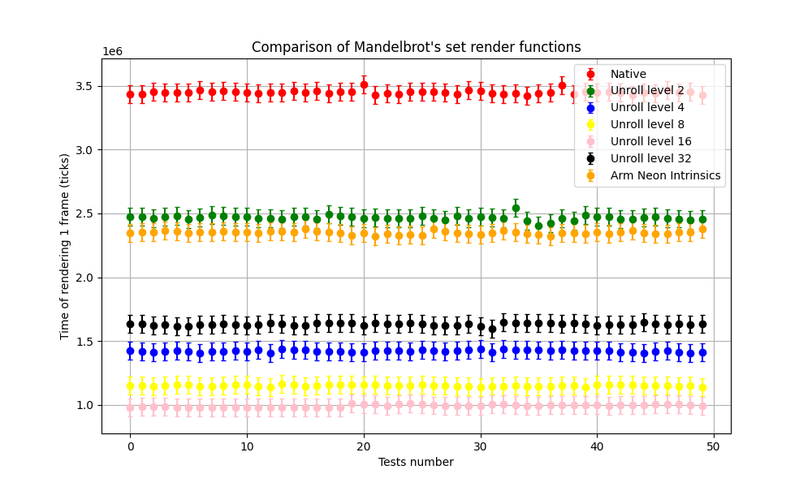

---

Как можно заметить на данном примере **лучший результат** показывает развертка массива в 16 раз, то есть одновременный просчёт 16 пикселей. Развертка в 32 раза оказывается медленнее по нескольким причинам: при таком уровне развертки ухудшается попадание в кэши, также при одновременной обработке 32 пикселей уже не хватает векторных регистров и компилятор вынужден выполнять многочисленные обращения в память, которые, конечно, приводят к значительному замедлению.

### Примеры из objdump развертки в 32 раза

<div style="display: flex; justify-content: space-between; align-items: center; gap: 10px;">
    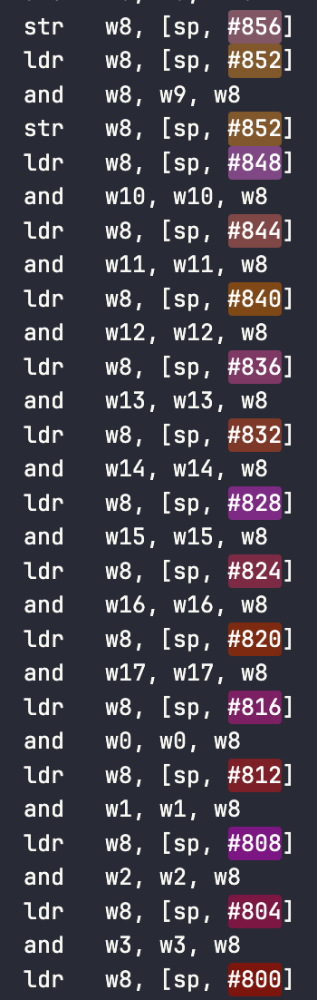
    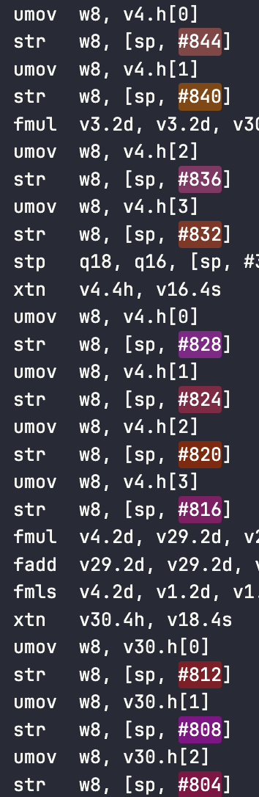
    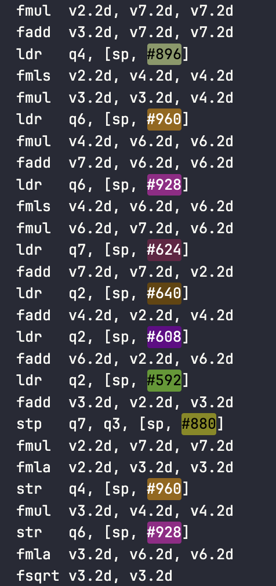
</div>

## 🔍 Самое интересное

Так как координаты каждой точки высчитываются в double-х, а размер векторных регистров на процессорах ARM как раз имеет размер 128 бит, получается реализация рендеринга с использованием SIMD инструкций должна быть наиболее близка к развертке в 2 раза, именно такой результат мы и наблюдаем на графике. Но почему же оптимизации, примененные компилятором проигрывают по производительности реализации, использующей SIMD инструкции?

Для ответа на этот вопрос рассмотрим участки objdump функций `getPixelColorArmNeon()` и `getPixelColorOptimized()`

### Arm Neon | Optimized:

<div style="display: flex; justify-content: space-between; align-items: center;">
    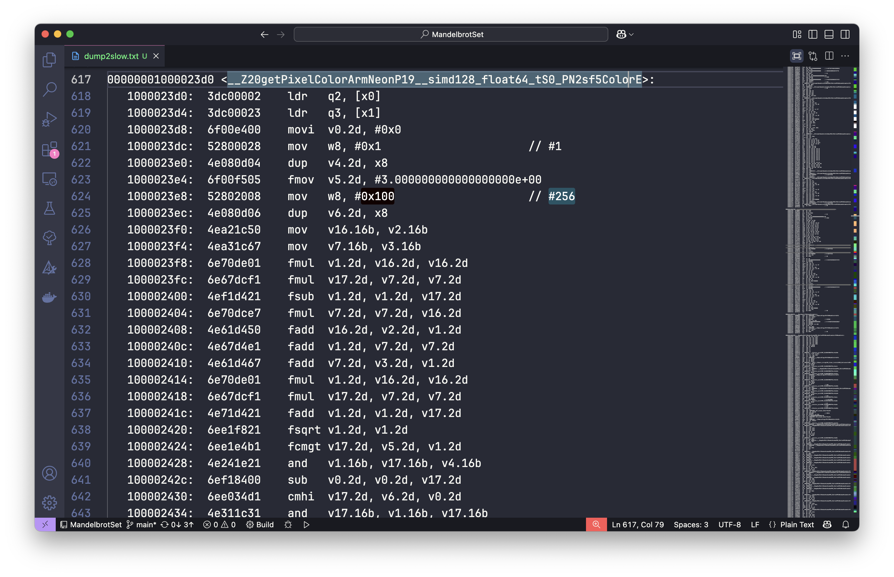
    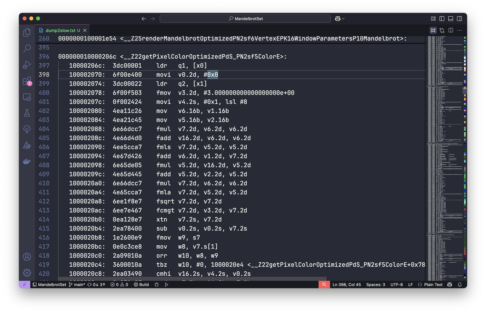
</div>

Можно заметить, что в версии справа гораздо больше зависимостей по данным, это и послужило одной из причин замедления, изменим алгоритм и снова посмотрим на objdump.

## Новый алгоритм
```c
    for(size_t i = 0; i < UNROLL_LEVEL; i++) {
        radius_vector_x_coords[i] = x_coords[i];
        radius_vector_y_coords[i] = y_coords[i];
    }

    while(continue_rendering) {
        for(size_t i = 0; i < UNROLL_LEVEL; i++) {
            xn[i] = radius_vector_x_coords[i];
            yn[i] = radius_vector_y_coords[i];
        }

        for(size_t i = 0; i < UNROLL_LEVEL; i++) {
            radius_vector_x_coords[i] = xn[i] * xn[i] - yn[i] * yn[i] + x_coords[i];
            radius_vector_y_coords[i] = 2 * xn[i] * yn[i] + y_coords[i];
        }

        for(size_t i = 0; i < UNROLL_LEVEL; i++) {
            radius_vector_length[i] = radius_vector_x_coords[i] * radius_vector_x_coords[i] + radius_vector_y_coords[i] * radius_vector_y_coords[i];
        }

        for(size_t i = 0; i < UNROLL_LEVEL; i++) {
            radius_vector_cmps[i] = (sqrt(radius_vector_length[i]) < MAX_RADIUS);
        }

        for(size_t i = 0; i < UNROLL_LEVEL; i++) {
            if(radius_vector_cmps[i] != 0) {
                counter[i]++;
            }
        }

        continue_rendering = false;
        for(size_t i = 0; i < UNROLL_LEVEL; i++) {
            if(counter[i] < MAX_ITERATIONS_COUNT && radius_vector_cmps[i] != 0) {
                continue_rendering = true;
            }
        }
    }

    for(size_t i = 0; i < UNROLL_LEVEL; i++) {
        if(radius_vector_cmps[i] == 0) {
            uint8_t r = (8 * counter[i]) % 255;
            uint8_t g = (1 * counter[i]) % 255;
            uint8_t b = (4 * counter[i]) % 255;

            colors[i] = {r, g, b, 255};
        } else {
            colors[i] = sf::Color::Black;
        }
    }
```

*Что произошло?* - независимые по данным операции были объединены, таким образом уменьшилось количество циклов, а группировка послужит дополнительной подсказкой компилятору к более оптимальному использованию векторных инструкций.

### Objdump getPixelColorOptimized()

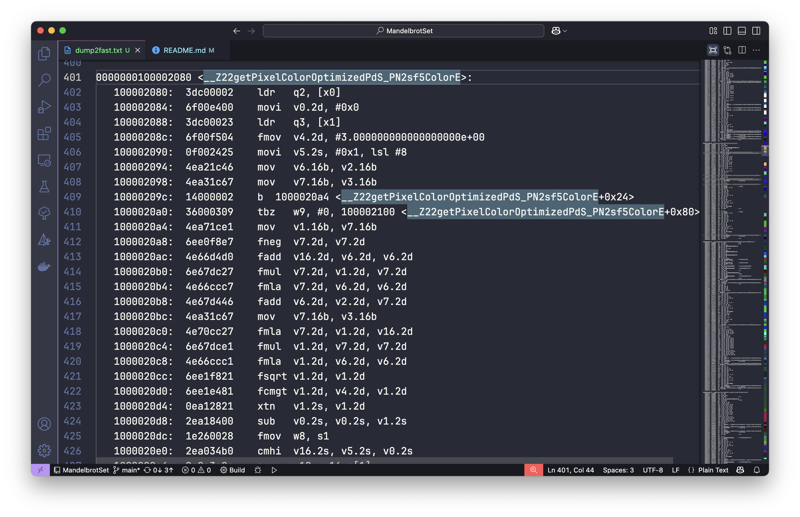

Чтож, произошло не совсем то, что мы ожидали - зависимостей по данным не уменьшилось, но как можно заметить алгоритм значительно изменился, пора заново прогнать тесты и взглянуть на результаты.

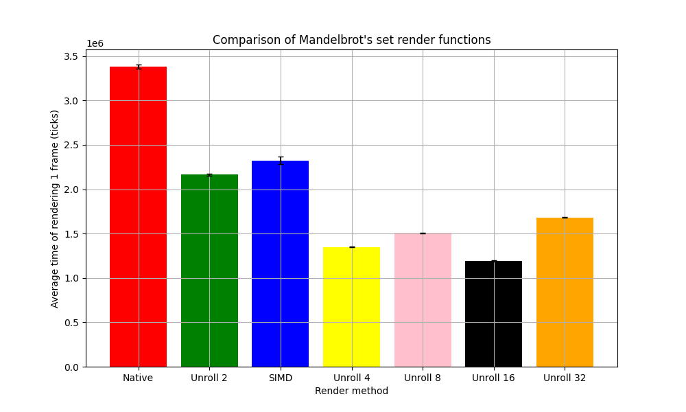
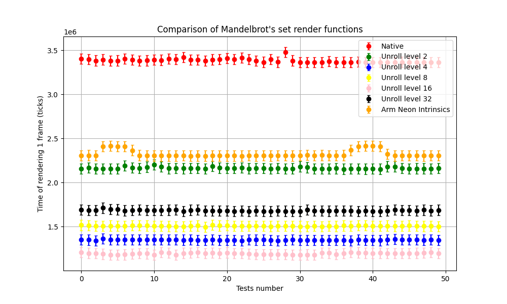

Интересно, теперь развертка в 2 раза работает быстрее векторной реалезации, но версии, разворачивающие циклы в 8, 16, 32 раза замедлелись 📉, снова смотрим **objdump развертки в 8 раз**:

### Старая реализация | Новая реализация
<div style="display: flex; justify-content: space-between; align-items: center;">
    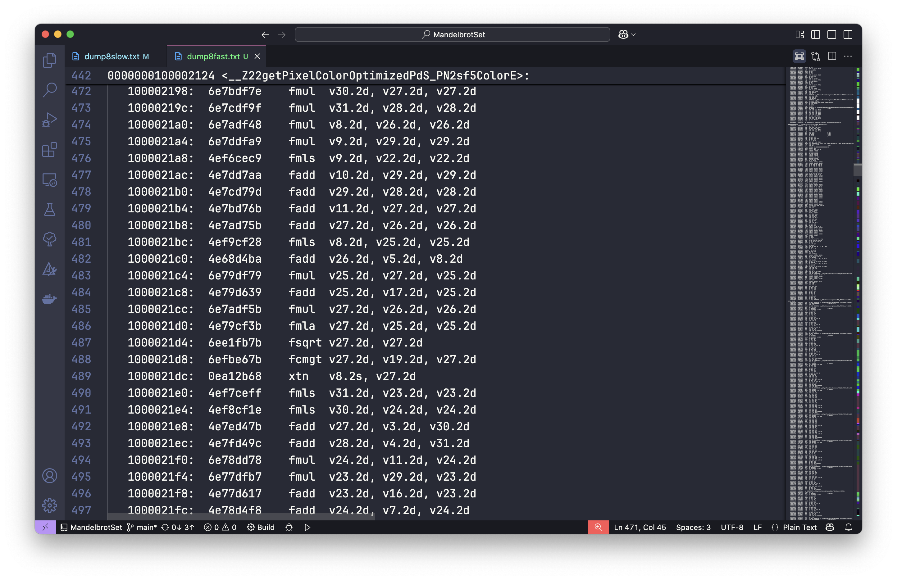
    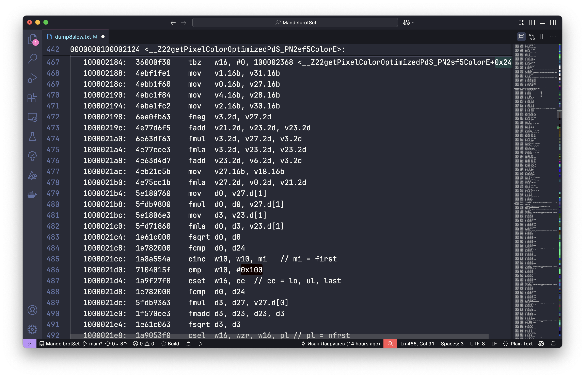
</div>
Смена алгоритма привела к необходимости использовать 64 битные `d` регистры, что будет работать медленнее, чем вычисления векторных регистров по 128 бит.

**Вывод:** Оптимизации необходимо тестировать для конкретной версии программы, так как действия, приводящие к ускорению в одном кейсе использования могут приводить к замедлению в другом.

## 💡 Заключение

Этот проект демонстрирует эффективность использования векторных инструкций для ускорения вычислительно сложных задач и возможности использования этих инструкций современными компиляторами, ведь как было показано, при правильной группировке данных и вычислений, связанных с ними, компилятор прекрасно справляется с подстановкой векторных инструкций вместо обычных. Благодаря параллелизму SIMD время рендеринга значительно сокращается, особенно для изображений высокого разрешения или большого числа итераций. Дальнейшие оптимизации, такие как исопользование мощностей GPU, могут быть применены для достижения еще большей производительности.
